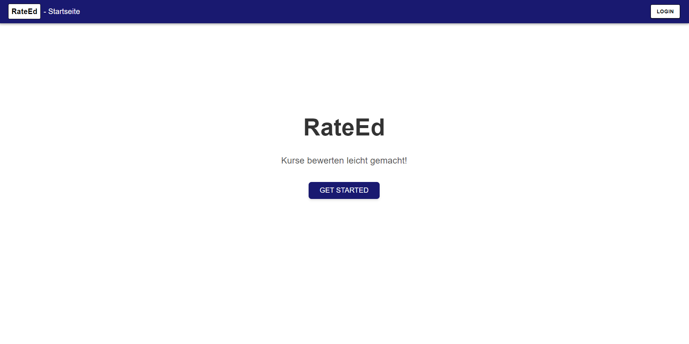
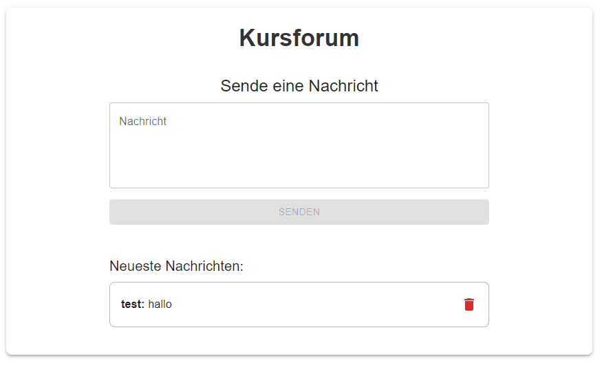

# RateEd

### RateEd provides a university course rating and discussion forum, allowing fellow students to share experiences about their courses so new students can decide which courses to take.

## Features:

- Creating accounts
- Adding a course to the database containing the following information about the course:
  - name
  - semester
  - professor
  - universityChair
  - examDate
  - examAdmission
  - tutorial
  - oldExam
  - bonusPoints
  - moodleKey
- Searching the courses that have been added to the database
- Rating courses based on three factors:
  - Frage 1
  - Frage 2
  - Frage 3
- Gathering insight on the average rating of said factors + an overall rating
- Writing and reading comments about experiences on a course (every course has its own forum)

## Screenshots:
### Landing page:

### Course forum:


## Technical architecture:

- MERN-Stack
- services are implemented using react's useContext hook and ApiProvider (api-context.jsx)
- services always send api requests to the url starting with "/api/..."
- vite-config.js removes the "/api" and routes the api requests to port 3000 (server)
- server.js routes api requests to corresponding routers e.g. "/users/..." -> userRouter
- ...-routes.js routes the requests to corresponding controller methods

## Technologies / libraries used:

- MERN-Stack ()
- bcrypt: encryption for storing passwords in database
- materialUI (e.g. DatePicker, AdapterDateFns)

## How to deploy:
### Step 1 - install dependencies:
- Open a terminal in folder react-client:
```bash
  cd react-client 
```
- Install dependencies using:
```bash
  npm install 
```
- Repeat for server:
```bash 
  cd ..
```
```bash
  cd server
```
```bash
  npm install
```

### Step 2 - build and run the frontend:
- Open the terminal in react-client directory
```bash
  cd ..
```
```bash
  cd react-client
```
- Build the project
```bash
  npm run build
```
- Run the development environment
```bash
  npm run dev 
```

### Step 3 - start the server:
- Open new terminal in server directory
```bash
  cd server
```
- Run the server
```bash
  npm start server
```